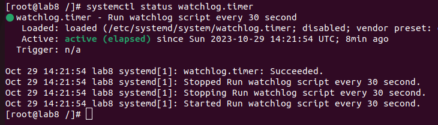
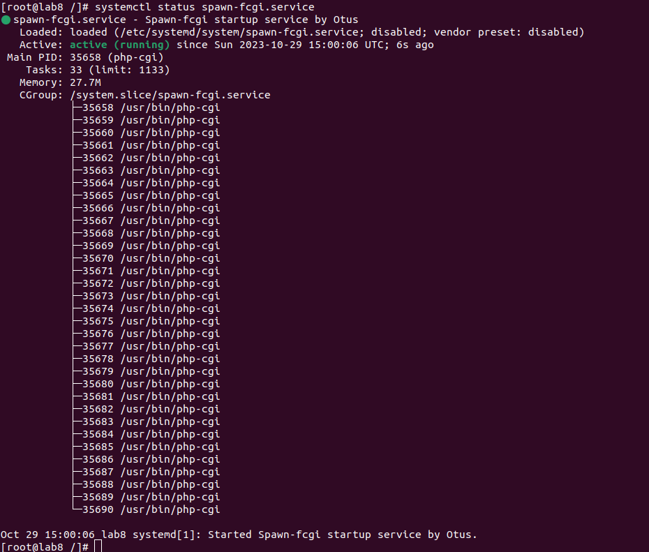
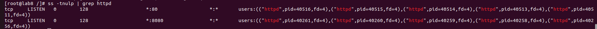

# Домашнее задание №8 "Systemd - создание unit-файла"

## Цель:научиться редактировать существующие и создавать новые unit-файлы

## Задания:
1. Написать service, который будет раз в 30 секунд мониторить лог на предмет наличия ключевого слова (файл лога и ключевое слово должны задаваться в /etc/sysconfig или в /etc/default).
1. Установить spawn-fcgi и переписать init-скрипт на unit-файл (имя service должно называться так же: spawn-fcgi).
1. Дополнить unit-файл httpd (он же apache2) возможностью запустить несколько инстансов сервера с разными конфигурационными файлами.

## Решение:
1. При выполнении `vagrant up` разворачивается система в которую копируются конфигурационные файлы ([watchlog.sh](./watchlog.sh), [spawn-fcgi.service](./spawn-fcgi.service), [httpd.service](./httpd.service), [watchlog](./watchlog/)), а затем выполнятеся [скрипт](./script.sh)).
1. [Скрипт](./script.sh) выполняет следующие действия:
    - устанавливает требуемые пакеты.
    - создаем и правит конфигурационные файлы, настраивает скрипты и сервисы в соответствии с заданием.
    - Запускает сервисы.
    - В результате мы получаем систему, с работающими сервисами в соответствии с заданием.

## Результат:
Выполнены все задания по настройке и созданию сервисов. Подготовлен vagrantfile c результатами выполнения д.з.:

| <!-- -->      | <!-- -->        | <!-- -->      |
|:-------------:|:---------------:|:-------------:|
|Сервис watchlog ||
|Сервис spawn-fcgi ||
|Сервис httpd ||
